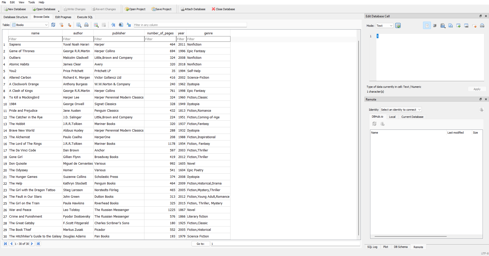

# Library Application

This is a simple library application implemented in Python. The application allows users to manage a library by adding books, removing books, searching for books, and displaying the list of available books.
The application utilizes SQLite as the database backend and supports data export in JSON and CSV formats.



## Features

- Show Books: Displays the list of books in the library.
- Search Book: Searches for a book by name and displays its details if found.
- Add Book: Adds a new book to the library.
- Remove Book: Removes a book from the library.
- Data Storage: The application uses SQLite to store book data.

## Prerequisites

- Python 3.x
- SQLite

## Installation

1. Clone the repository:

   ```shell
   git clone https://github.com/your-username/library-application.git
2. Change into the project directory:
   ```shell
   cd library-application
3. Install the required dependencies:
   ```shell
   pip install -r requirements.txt

## Usage
1. Make sure you have SQLite installed on your system.

2. Run the library.py file to start the library application:
   ```shell
   python library.py

3. Follow the on-screen instructions to perform various operations:

   - Enter 1 to show the list of books in the library.
   - Enter 2 to search for a book by name.
   - Enter 3 to add a new book to the library.
   - Enter 4 to remove a book from the library.
   - Enter q to quit the application.
## Contributing
Contributions are welcome! If you find any issues or want to enhance the application, feel free to submit a pull request.


## License
This project is licensed under the MIT License.

[](https://github.com/yourusername/library-app/blob/main/LICENSE)
   


   

   
   

